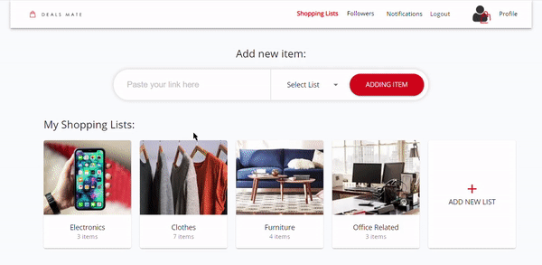

# DEALSMATE

## The Deal Tracker

### The website that tracks products on a user's wishlist, and notifies them on any price changes.

**Contents:**\
[Run Instructions](#how-to-run)\
[Core Functionality](#core-functionality)\
[Additional Features](#additional-features)\
[Authors](#authors)

## How to Run

To run the application **in dev mode**, type `npm run dev` or `yarn run dev`.\
To **not run in dev mode**, type `npm run dealsmate` or `yarn run dealsmate`.

_Alternatively_\
Type `cd client` followed by `npm start` to only start the client.\
Followed by:\
Type `cd server` followed by `npm run start` to only start the server **OR**\
Type `cd server` followed by `npm run dev` to only start the server in dev mode.

## Core Functionality

**NOTE:** Drop down list not appearing in following gifs. Drop down list includes all of the current user's lists.

### Adding to Lists

Click on "Add item" straight from the dashboard after inputting a valid URL where it says "place your link here"\

**OR** Click on "Add new item" after clicking on a list, and do the same.\

### Removing from Lists

Click on "Remove" over a certain product in a list to permanently remove that product from that list.\

## Additional Features

### Followers

## Authors

Sagnik Roy\
Ricardo Brites
